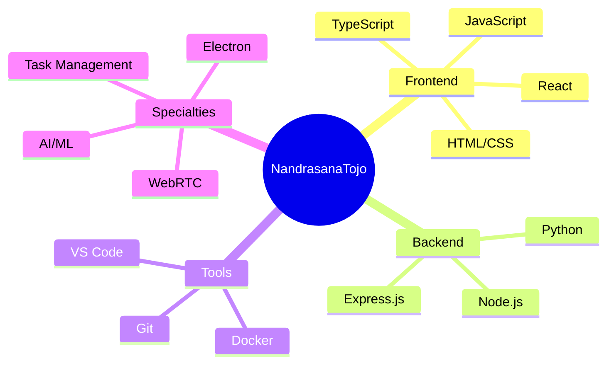

<div align="center">
  
# 🚀 Welcome to My Profile


[](https://github.com/NandrasanaTojo)
[](https://github.com/NandrasanaTojo)

</div>

---

## 🎯 About Me

```typescript
const developer = {
    name: "NandrasanaTojo",
    location: "🌍 Global",
    role: "Full Stack Developer & AI Enthusiast",
    languages: ["JavaScript", "TypeScript", "Python"],
    interests: ["Web Development", "AI/ML", "WebRTC", "Electron Apps"],
    currentFocus: "Building innovative solutions with modern technologies",
    funFact: "I love turning complex problems into simple, elegant solutions"
};
```

## 🛠️ Tech Stack & Tools

<div align="center">

### 💻 Languages


### 🚀 Frameworks & Libraries


### 🔧 Tools & Technologies


</div>

## 📊 GitHub Analytics

<div align="center">
  


</div>

<div align="center">
  
[](https://git.io/streak-stats)

</div>


## 📈 Contribution Graph

<div align="center">
  
[](https://github.com/ashutosh00710/github-readme-activity-graph)

</div>

## 🎨 Skills Visualization



## 🏆 GitHub Trophies

<div align="center">
  
[](https://github.com/ryo-ma/github-profile-trophy)

</div>

```
